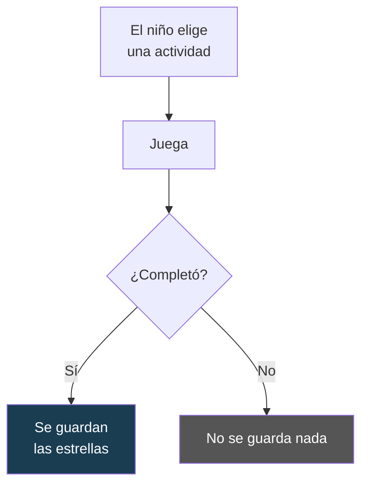
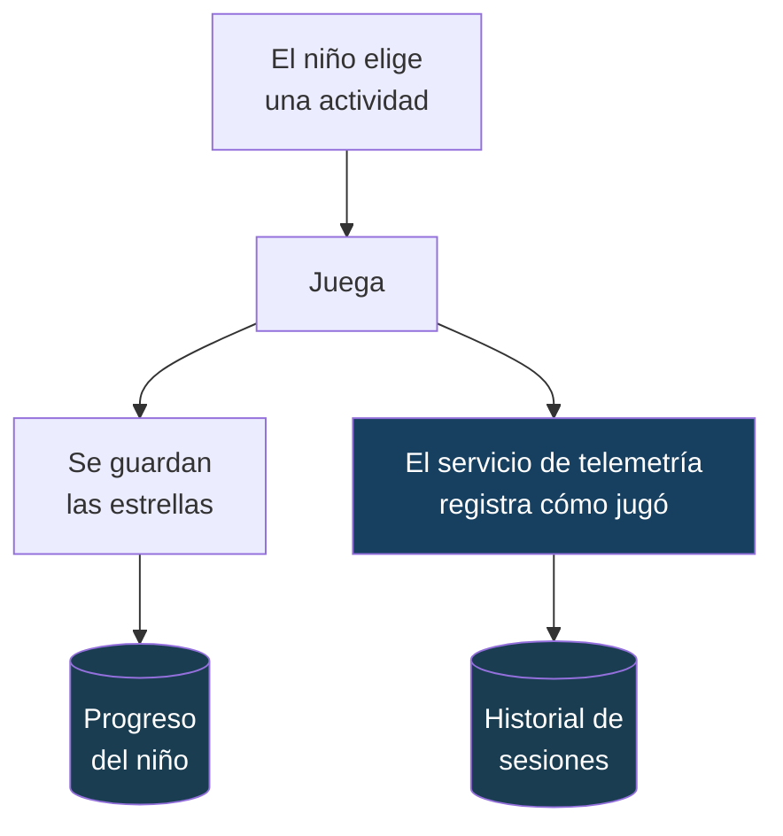
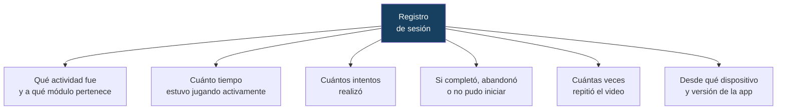
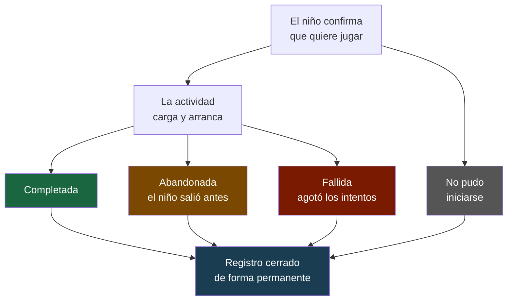
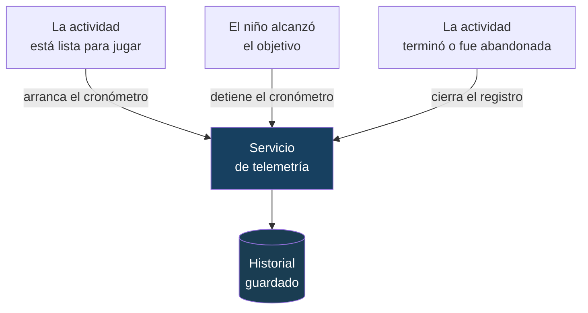
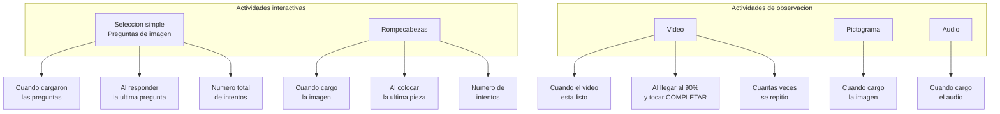
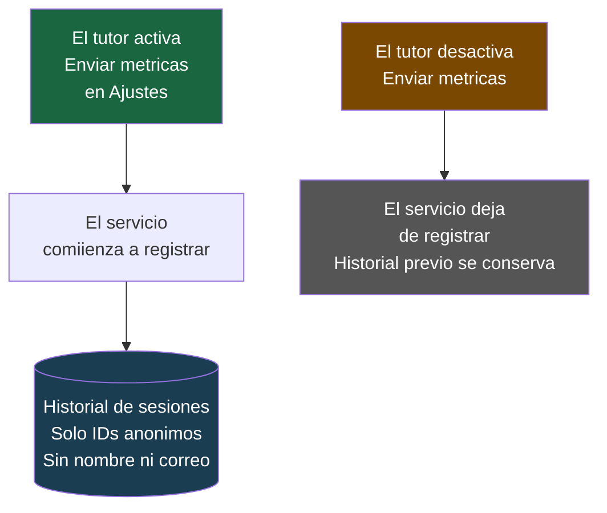
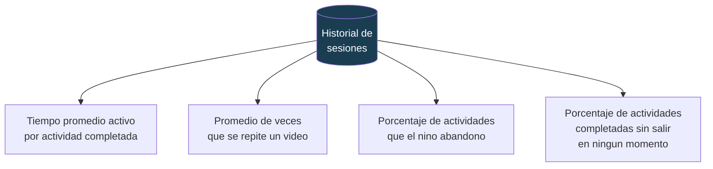
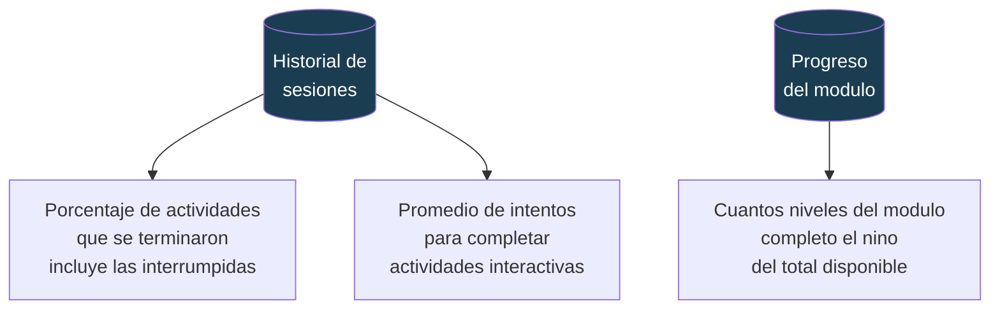

# Diagramas de telemetría — Appy

**Proyecto:** Appy · **Fecha:** Septiembre 2026

---

## 1. Qué registraba la app antes

El único dato que se guardaba al terminar una actividad era si el niño ganó
estrellas. No había forma de saber cómo llegó a ese resultado.

**Lo que no se podía medir:**
- Cuánto tiempo pasó el niño realmente jugando.
- Si salió antes de terminar, y por qué.
- Cuántos intentos le tomó llegar al resultado.
- Si repitió un video varias veces.

---

## 2. Qué registra la app ahora

Se añadió un servicio de telemetría que observa cada sesión de juego en
paralelo, sin modificar la experiencia del niño ni los minijuegos en sí.

---

## 3. Qué guarda el servicio de telemetría

Cada vez que un niño juega, se crea un registro único que va tomando datos
a medida que avanza la actividad.

---

## 4. Ciclo de vida de una sesión

Cada sesión pasa por etapas bien definidas. Una vez que termina —de
cualquier forma— el registro queda cerrado y no puede modificarse.

---

## 5. Cómo se conecta la telemetría con los minijuegos

Los minijuegos no saben que existe la telemetría. Solo avisan tres momentos
clave; el servicio decide qué registrar en cada uno.

### 5a. Los tres momentos que avisa cualquier actividad

### 5b. Qué avisa cada tipo de actividad

---

## 6. Consentimiento y privacidad

El servicio de telemetría solo actúa si el tutor ha activado la opción en
ajustes. Nunca se guarda nombre, correo ni información personal.

---

## 7. Los 7 indicadores — Mediciones de uso (KPI 1 a 4)

Todas las respuestas se calculan consultando el historial de sesiones guardado,
dentro de un rango de fechas elegido por el dashboard.

---

## 8. Los 7 indicadores — Mediciones de uso (KPI 5 a 7)

---

## 9. Resumen comparativo

| | Antes | Ahora |
|---|---|---|
| Datos guardados al jugar | Solo estrellas | Tiempo activo, intentos, estado, replays |
| Saber si el nino abandono | No | Si, con motivo |
| Medir tiempo real de juego | No | Si, solo el tiempo activo |
| Impacto en el nino | — | Ninguno, el servicio es invisible |
| Privacidad | — | Sin nombre, correo ni datos personales |
| Indicadores disponibles | 0 | 7 KPI consultables por rango de fecha |
